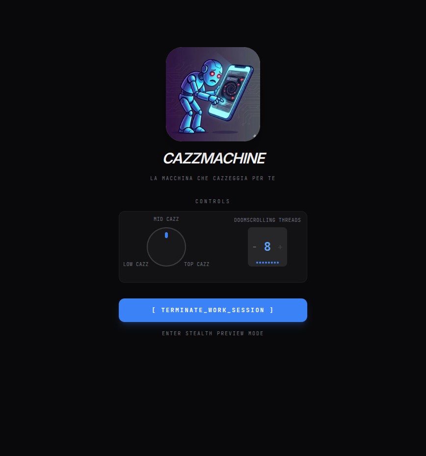

# Cazzmachine

It's Monday again. You're back in the office, slaving at the terminal. An icon beckons from the side pane, tantalising, alluring. The browser.

"Screw work!" you grunt, and click.
And click. And click again.

Suddenly your work day is over, and all you have done is browsing with glazed eyes through unfunny jokes, half-heartedly smiling at animal videos of dubiously authentic nature, and gaining an unsavoury expertise on the unsavoury secrets of some lesser celebrity. 
Meanwhile, work to do piles higher and higher. You know that tomorrow it will be there, waiting for you. And again you will ignore it, forever doomed to doomscrolling, until the inevitable deadline hits you in the neck.

If only the curse of curiosity could be lifted. If only someone - something - could bear the burden of cat videos and dank memes - the internet *cazzeggio*, as Alighieri's wittier descendants aptly call it - in your place. If only there were a Cazzmachine.

But now, my friend, there is. 

Let the browser icon lie neglected - let the Cazzmachine toil! And as you steadfastly dive deep into your work, let the Cazzmachine dive with equal depth and resolve in the most obscure of Reddit's nooks, with nothing to disturb your concentration, now that every humourous gem is meticulously catalogued and stored for you to - possibly, though not advisedly - view later. And should you feel tempted to take a break, leave that browser icon alone - just turn the doomscrolling knob to the *top cazz* setting, and let the Cazzmachine take care of it!

No longer will you be unproductive. No longer will you waste hours consuming machine-generated drivel, in mindless *cazzeggio*.

For now comes the era of the Cazzmachine.
<p align="center">

</p>


## Features

- **Autonomous Content Consumption**: Automatically crawls entertaining content from various sources
- **Smart Buffering**: Maintains a buffer of ~20 unconsumed items per thread, downloading more only when needed
- **Consumption Simulation**: Simulates realistic time costs for consuming different content types
- **Multithreaded Consumption**: Launch 1-8 parallel "doomscrolling threads" for maximum procrastination efficiency
- **Doomscroll Control**: Adjustable intensity knob (1-9) controls phase duration and crawl frequency
- **Daily Pruning**: Automatically cleans old data to minimize storage footprint
- **Terminal Aesthetic**: Clean, monospace-heavy UI throughout

## Screenshots

<p align="center">

<br>
<em>The main interface: adjust your doomscrolling intensity with the throttle knob (1-9) and set parallel thread count (1-8) with the heat map selector</em>
</p>

## Architecture

The app consists of two main parts:

1. **Rust Backend** (`src-tauri/`)
   - CrawlScheduler: Downloads content when buffer is low (< 20 items)
   - NotificationEngine: Triggers doomscrolling phases at intervals
   - SQLite Database: Stores items with consumption state

2. **React Frontend** (`src/`)
   - IdleView: Main dashboard with knob and stats
   - DetailView: Browse consumed items
   - Summary: End-of-session report

## Prerequisites

- **Node.js** 18+ with npm
- **Rust** 1.70+ (install from [rustup.rs](https://rustup.rs))
- **Tauri CLI**: `cargo install tauri-cli` (optional, or use npm scripts)

## Development

Clone the repository:

```bash
git clone https://github.com/diego-conti/cazzmachine.git
cd cazzmachine
```

Install dependencies:

```bash
npm install
```

Run in development mode:

```bash
npm run tauri dev
```

This starts both the Vite dev server and the Tauri app with hot reload.

## Building from Source

### Desktop (Linux)

```bash
npm run tauri build
```

Output locations:
- **Debian package**: `src-tauri/target/release/bundle/deb/*.deb`
- **AppImage**: `src-tauri/target/release/bundle/appimage/*.AppImage`
- **Binary**: `src-tauri/target/release/cazzmachine`

Install the Debian package:

```bash
sudo dpkg -i src-tauri/target/release/bundle/deb/cazzmachine_*.deb
# Fix any dependency issues:
sudo apt-get install -f
```

Or run the AppImage directly:

```bash
chmod +x src-tauri/target/release/bundle/appimage/cazzmachine_*.AppImage
./src-tauri/target/release/bundle/appimage/cazzmachine_*.AppImage
```

### macOS

```bash
npm run tauri build
```

Output:
- **DMG**: `src-tauri/target/release/bundle/dmg/*.dmg`
- **App**: `src-tauri/target/release/bundle/macos/*.app`

### Windows

```bash
npm run tauri build
```

Output:
- **Installer**: `src-tauri/target/release/bundle/msi/*.msi`
- **Executable**: `src-tauri/target/release/cazzmachine.exe`

### Android

Prerequisites:
- **Android Studio** with SDK, NDK, and Command-line Tools installed
- Or install SDK manually: https://developer.android.com/studio#command-line-tools

Build from source:

```bash
export ANDROID_HOME=$HOME/Android/Sdk
export NDK_HOME=$ANDROID_HOME/ndk/26.1.10909125
npm run tauri android build
```

To install on your device:

```bash
# Enable "Install from unknown sources" in Android settings
adb install path/to/cazzmachine-signed.apk
```

#### APK Signing

The built APK is unsigned and must be signed before distribution. Use your keystore:

```bash
# Sign the APK (replace with your keystore details)
jarsigner -keystore /path/to/your/keystore.jks \
  -signedjar cazzmachine-signed.apk \
  app-universal-release-unsigned.apk \
  your-alias-name

# Install on device
adb install cazzmachine-signed.apk
```

**Important:** The signed APK (`cazzmachine-signed.apk`) in the repository root must be kept up to date for GitHub releases.

## Project Structure

```
cazzmachine/
├── src/                    # React frontend
│   ├── components/         # UI components
│   ├── hooks/              # Custom React hooks
│   ├── stores/             # Zustand state management
│   └── lib/                # Tauri API wrappers
├── src-tauri/              # Rust backend
│   ├── src/
│   │   ├── crawler/        # Content providers (Reddit, etc.)
│   │   ├── db/             # Database models and queries
│   │   ├── notifications/  # Timer and event emission
│   │   └── commands.rs     # Tauri command handlers
│   ├── migrations/         # Database migrations
│   └── icons/              # App icons
├── public/                 # Static assets
└── package.json
```

## Configuration

The app stores data in:
- **Linux**: `~/.local/share/com.cazzmachine.app/`
- **macOS**: `~/Library/Application Support/com.cazzmachine.app/`
- **Windows**: `%APPDATA%/com.cazzmachine.app/`
- **Android**: Internal storage at `/data/data/com.cazzmachine.app/`

Database file: `cazzmachine.db`

## Testing

This project uses a multi-layered testing approach:

### Unit Tests (Vitest)

Run: `npm run test`

Tests for pure functions and React components using Vitest.

```
__tests__/
├── appStore.test.ts      # State management functions
├── tauriCommands.test.ts # Tauri command wrappers
└── urlOpening.test.ts   # URL handling logic
```

### Frontend E2E Tests (Playwright)

Run: `npm run test:e2e`

Tests the frontend in a browser using Playwright. Uses Vite dev server (no Tauri backend required).

```
e2e/
├── app.spec.ts         # Main app UI tests
├── navigation.spec.ts  # View navigation tests
└── tauri.spec.ts      # Frontend/Tauri integration
```

### Full Tauri E2E Tests

Run: `npm run test:e2e:tauri`

Tests the complete application including the Tauri backend. Requires the full dev environment and takes longer to run.

```
e2e/
└── tauri-full.spec.ts  # Full backend integration tests
```

### Rust Backend Tests

Run: `npm run test:rust`

Integration tests for the Rust backend, focusing on database operations and concurrency.

```
src-tauri/tests/
└── db_tests.rs  # Database workflow tests
```

### Test Commands Summary

| Command | Tests | Description |
|---------|-------|-------------|
| `npm run test` | 32 | Unit tests (Vitest) |
| `npm run test:e2e` | 15 | Frontend E2E (Playwright + Vite) |
| `npm run test:e2e:tauri` | 20 | Full E2E (Playwright + Tauri) |
| `npm run test:rust` | 9 | Backend tests (Cargo) |
| `npm run test:all` | 76 | All tests combined |

### Running All Tests

```bash
# Run all tests
npm run test:all

# Or individually
npm run test        # Unit tests
npm run test:e2e   # Frontend E2E
npm run test:rust  # Backend Rust
```

## Consumption Costs

Different content types have different "time costs":

| Type | Cost (minutes) |
|------|----------------|
| Meme | 0.5 |
| Joke | 0.3 |
| News | 2.0 |
| Video | 3.0 |
| Gossip | 1.5 |

During a doomscrolling phase, items are consumed until the budget (phase duration) is exhausted. Each thread runs independently with staggered durations (from budget/2 to full budget). Unconsumed items remain in the buffer for future phases.

### Crawling Behavior

The Cazzmachine uses a **pre-emptive crawling strategy** to ensure items are available when needed:

1. **At phase start**: If the buffer has fewer than `20 × thread_count` items, a crawl is triggered immediately to refill the buffer before consumption begins.
2. **Background crawling**: The CrawlScheduler maintains the buffer by fetching content when it drops below 20 items per thread.
3. **Provider rotation**: Each crawl fetches from a rotating selection of content providers (Reddit, news, jokes, memes, etc.).

This ensures that doomscrolling phases have content available and minimizes "No content found" messages.

## Doomscroll Levels

The knob (1-9) controls intensity:

| Level | Crawl Interval | Providers/Cycle | Phase Duration | Active % |
|-------|---------------|-----------------|----------------|----------|
| 1 (low) | 15 min | 1 | 1 min | 2% |
| 5 (mid) | ~8 min | 2 | 3 min | 47% |
| 9 (high) | 2 min | 3 | 5 min | 91% |

**Formulas:**
- **Scroll duration**: `S(level) = 1 + 4 × (level-1)/8` minutes
- **Standby time**: `W = S × ((1/A) - 1)` where A is active percentage (2% to 91% linearly)
- **Crawl interval**: `15 - (level-1) × 13/8` minutes
- **Providers**: `1 + (level-1) × 2/8` per cycle

## Multithreading

Set 1-8 parallel "doomscrolling threads" to multiply your consumption power:

- Each thread triggers independent consumption with staggered durations
- Buffer size scales automatically (20 items × thread count)
- Heat map style thread selector with color-coded intensity levels
- Perfect for maximum automated doomscrolling

## Diagnostics

The Cazzmachine includes a comprehensive diagnostic system to help troubleshoot issues, particularly the dreaded "No content found" message.

### Understanding "No Content" Messages

When you see "No content found. The internet is quiet... suspiciously quiet.", it means the consumption cycle completed without consuming any items. Common causes:

| Cause | Explanation | Solution |
|-------|-------------|----------|
| **Empty Buffer** | No items waiting in the database | Wait for the crawler to fetch content (check provider health) |
| **Budget Too Small** | Phase duration shorter than cheapest item (0.3 min) | Increase the doomscroll level knob |
| **All Items Too Expensive** | Pending items cost more than available budget | Wait for cheaper items (jokes/memes) or increase budget |
| **Provider Errors** | Crawlers failing to fetch content | Check provider status in diagnostic panel |

### Diagnostic Panel

Access the diagnostic panel for real-time system status:

**Method 1: URL Flag**
```
http://localhost:5173/?diagnostics=true
```

**Method 2: Debug Mode**
Enable debug mode in the browser console:
```javascript
useAppStore.setState({ debugMode: true })
```

The panel displays:
- **System Status**: Pending item count, buffer health, budget analysis
- **Provider Health**: Each content source's status, last fetch time, error counts
- **Recent Events**: Diagnostic log entries with timestamps and severity
- **Export**: Download full diagnostic data as JSON

### Debug Mode

Enable verbose logging to the browser console:

```javascript
// In browser console (F12)
useAppStore.setState({ debugMode: true })
```

Debug mode logs:
- State transitions (standby → doomscrolling → interrupted)
- Thread launch/completion with budgets
- Consumption results per thread
- Fetch errors with context

### Diagnostic Commands

The following Tauri commands are available for programmatic access:

| Command | Returns | Description |
|---------|---------|-------------|
| `get_diagnostic_summary()` | Pending count, buffer health, budget analysis | Overall system status |
| `get_provider_status()` | Array of provider health objects | Per-provider status and errors |
| `get_recent_diagnostics(limit)` | Array of diagnostic log entries | Recent events from database |
| `clear_diagnostics(days)` | Count of deleted entries | Clean up old diagnostic logs |

### Common Issues

**"No content found" appears frequently**
- Check provider health in diagnostic panel
- Look for high error counts (red numbers)
- Verify buffer health is "healthy" or "low"
- Check recent diagnostic events for crawl failures

**Providers show errors**
- Network connectivity issues (NetworkError/TimeoutError)
- Rate limiting from Reddit/APIs (RateLimitError)
- Temporary service outages
- Wait a few minutes and check again

**Buffer health shows "critical"**
- Crawler may be behind
- Increase doomscroll level temporarily to allow more crawling
- Check that at least one provider is healthy

## License

MIT

## Acknowledgments

Built with:
- [Tauri](https://tauri.app/) - Rust-based desktop framework
- [React](https://react.dev/) - UI library
- [Tailwind CSS](https://tailwindcss.com/) - Styling
- [Zustand](https://github.com/pmndrs/zustand) - State management
